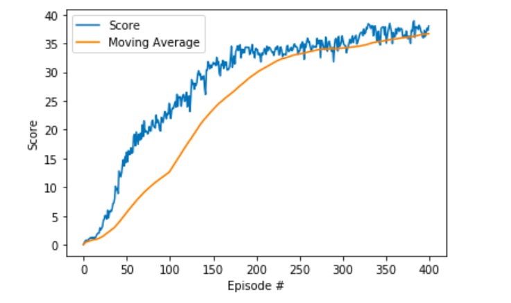
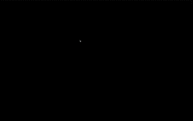

# Report - Continuous Control with Deep Deterministic Policy Gradients

The work desribed in this report was completed as part of the submission for the Deep Reinforcement Learning nanodegree by Udacity.


## Introduction


## Implementation Details

```python

for i in range (self.num_agents):
  state,action,reward,next_state,done = multi_states[i,:], multi_actions[i,:],multi_rewards[i],multi_next_states[i,:],           multi_done[i]
  self.memory.add(state, action, reward, next_state, done)
```


```python
if time_step%20== 0 and len(self.memory) > BATCH_SIZE:
    for j in range(10):
        experiences = self.memory.sample()
        self.learn(experiences, GAMMA)
```

```python
self.critic_optimizer.zero_grad()
        critic_loss.backward()
        torch.nn.utils.clip_grad_norm(self.critic_local.parameters(), 1)
        self.critic_optimizer.step()
```


### Network Architecture

The network architecture is unchanged from the provided code and is desribed below.

The actor network maps states to actions with the following simple architecture.

* A fully connected layer with 256 dimension followed by Relu activation

* An output layer to the action dimension follwed by tanh activation.


The critic network maps the state-action space to a single value using the following architecture;

* The 33 dimensional state is fed through a fully connected layer of 256 dimensions followed by Leaky Relu activation.

* The 256 dimesional output is combined with the 4 dimensional action and fed into a fully connected layer of 256 dimeniosn followed by Leaky Reul activation.

* A 128 dimensional fully connected layer followed by Leaky Relue

* A 1 dimensional output layer.


### Hyperparameters

HyperParameter | Description | Value
------------ | ------------- | -------------  
BUFFER_SIZE | Size of the Replay buffer| 2e5
BATCH_SIZE | Size of each minibatch for gradient update| 1024
GAMMA| The discounting factor| 0.99
TAU | Soft update parameter| 1e^-3
LR_ACTOR | Learning rate of the actor | 1e^-4
LR_CRITIC | Learning rate of the critic | 1e^-4
N_TIMESTEP | Number of timesteps between learning from experiences | 20
N_GRAD_UPDATE| Number of updates performed every N_TIMESTEPS | 10
MU | Drift parameter of the OU process used to add noise to the actions | 0
THETA | Speed paramaeter of the OU process used to add noise to the actions | 0.15
SIGMA | Volatility parameter of the OU procc used to add noise to the actions | 0.2


## Results

A single training run was made with the final agent.

The environment is considered solved when the average score of the 33 agents over 100 episodes is maintained at or above 30.

Our agent acheived this after episode 202.

The score (averaged over all agents) for each episode and the average score over the previous 100 episodes is plotted below.


Format: 


The unity environment includes tools for visualtion. Below is a short clip of the trained agent(after 400 episodes) in the envrionment. The full epidode has been posted on [YouTube](https://www.youtube.com/watch?v=OseH3sEPzuI)


